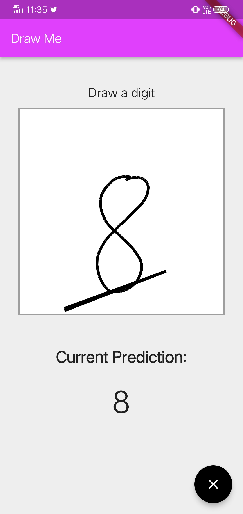

## Draw Me

a baby teacher. Lets AI Teach... 

#### A Sample AI Mobile Application to learn digits for babies.

>  “Artificial intelligence would be the ultimate version of Google. The ultimate search engine that would understand everything on the web. It would understand exactly what you wanted, and it would give you the right thing. We're nowhere near doing that now. However, we can get incrementally closer to that, and that is basically what we work on.” - Larry Page.

**In Future the AI Leads the Mankind**

_**Getting Started**_

### [MNIST Dataset](https://data.deepai.org/mnist.zip) 
   The Dataset for Hand Written Images. It is a Global Dataset

_Metrics_ 
**Accuracy - 97%**
**Loss - 0.48953**

### Results

                 
                 
 

Author    -   [Surya Teja Menta](mailto:mentasuryateja@gmail.com) 
contacts  -   +91 8309584461
